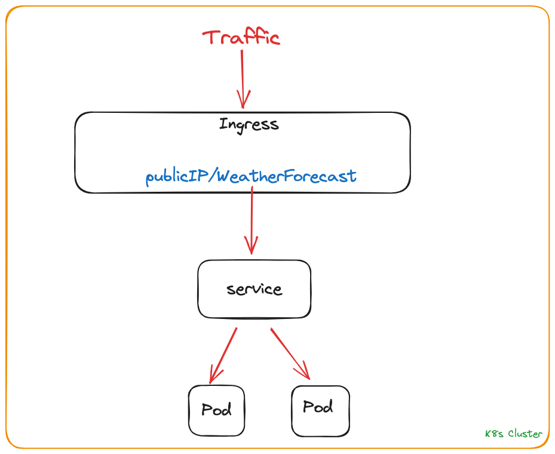

This repository contains solution of roofstacks infrastructure-developer case

## Table of Contents
- [Details](#details)
- [Solution](#solution)

## Details
- Clone the GitHub repo on your local which is specified as [sample-app](sample-app/). ✅
- Create a docker file for building a .net core web app within the docker image. ✅
- You need to create a DockerHub account for uploading image. ✅
- Build a docker image and upload this to the DockerHub. ✅
- Create a kubernetes definition file for :
     - Create one ingress for handling HTTP requests from outside the cluster ✅
     - Create one service for load balancing across the pods ✅
     - Create a deployment with two pods that are hosting our app instances from DockerHub (which is you've uploaded). ✅
- You should be able to test the application with the following URL pattern with HTTP GET request when you complete it : ✅
     - > http://{{IP}}:{{Port}}/WeatherForecast

- You could prepare one-click install script file as bash or shell to install and run the mini-cluster. ✅

## Solution
Created a Dockerfile to containerize the application, used multi stage build to reduce image size. Pushed the image to my personal docker hub account.

Used Google Kubernetes Engine on Google Cloud as kubernetes cluster. Created ingress, service, deployment and backend-config resources. When i create ingress on GKE it creates backend services on LB and default path of backend services' health check is "/". But our application doesnt serve anything on path "/" so our backend services gets unhealthy state.

To fix that i create a backend-config resource and update the path as "/WeatherForecast" also i add an extra annotation on service to use my custom backend-config resource. With that backend services gets healthy state and ingress works.

You can test the application on http://34.120.2.10/WeatherForecast

I draw a small diagram to show flow. 

